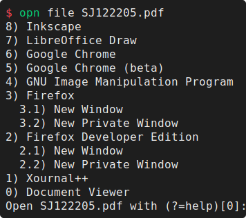

# OPN - a file opener

`opn`, pronounced _open_ (creative, I know), allows you to pick the application to open a file with
in the terminal from a list of preferred applications.

## Features
- Provides a terminal interface with a list of supported applications that can open a file.
- The list of supported applications is based on the well-established `.desktop` files.
- bash/fish/zsh completions.
- Opens both GUI and terminal applications.
- Integrates with various tools such as:
  - [nnn](./integrations/README.md#nnn).
  - [JetBrains IDEs](./integrations/README.md#jetbrains-ides).

## Installation
See [Install.md](Install.md).

## How it works
To determine the list of programs that are suggested for a file, the 
[MIME Applications Specification](https://specifications.freedesktop.org/mime-apps-spec/1.0.1/)
is used.

A simplified explanation:
- `.desktop` files, located in `$XDG_DATA_HOME/applications` and `$XDG_DATA_DIRS/applications`,
  specify the name of applications, their path, and optionally some MIME types they can open.
  These files are typically included when installing applications.  
  The name of these files equals the _desktop ID_.
  See the [Desktop Entry spec](https://specifications.freedesktop.org/desktop-entry-spec/1.5/index.html#).
- `mimeapps.list` files, located in one of the [specified directories](https://specifications.freedesktop.org/mime-apps-spec/1.0.1/file.html),
  associates a MIME type with desktop IDs.
- `opn` reads these desktop and `mimeapps.list` files to determine the MIME-application association.
- When `opn file path/to/file` is executed, `xdg-mime` or `file` is used to determine the MIME type
  of the file. Then, the MIME is looked up in the MIME-application index to find all associated
  applications.

## Requirements
- `xdg-mime` (preferred, better accuracy, `xdg-utils` package) or `file`

## Terminal applications
Some applications require a terminal to launch in. Examples of this include; vim, nano, nnn, and opn
itself. These applications have `Terminal=true` in their respective desktop files.

### Which terminal to open in?
Unfortunately, there is no specification yet, though
[one is being developed](https://gitlab.freedesktop.org/terminal-wg/specifications/-/merge_requests/3),
on how to set a preferred terminal emulator across Desktop Environments or systems without one.
This requires an environment variable to make `opn` aware of your preference.

Specify the terminal to be launched using the `TERMINAL_COMMAND` or `OPN_TERM_CMD` environment
variable. The latter takes precedence. E.g:
- `foot`
- `gnome-terminal --`

### Attaching to terminal
By default, GUI applications are started detached from the terminal and terminal applications are
opened in the current terminal. For documentation on how to control this behavior, see
[docs/cli/opn_file.md#attaching-to-terminal](./docs/cli/opn_file.md#attaching-to-terminal).

## Usage
Open a file using `opn file /path/to/file`.

For detailed usage, see `opn --help` or view the [CLI docs](./docs/cli/opn.md).

## TODO
- Document integration with NNN
- Pacman/package manager hook to update cache
- Add examples on how to change preferred applications.
- Support DBUS activation for starting applications. Pending interest.
