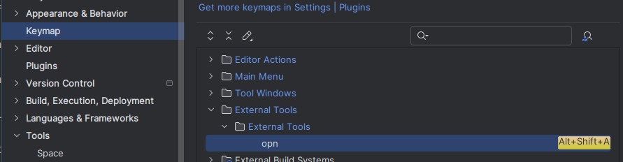

# Integrations
This document describes how `opn` can be integrated with other tools.

Table of contents:
- [JetBrains IDEs](#jetbrains-ides)
- [nnn](#nnn), the terminal file manager
- [xdg-open](#xdg-open), an opener used by many applications.

## JetBrains IDEs

### Replacing xdg-open
The _Open in associated application_ action in JetBrains IDEs uses `xdg-open`.
Replacing `xdg-open` is an easy way to make your IDE use `opn`.
See [xdg-open integration](#xdg-open).

### Custom shortcut
A JetBrains IDE shortcut can be configured to show `opn` for a selected or open file.

1. Open settings > Tools > External tools, click on the `+` icon, and
   enter the following data:
    - Name (Arbitrary)
    - Program: `opn`
    - Arguments: `file "$FilePath$"`
    - Working directory (optional): `$ProjectFileDir$`
    - Check _Open console for tool output_
    - _Make console active on message in stdout_  
      Unfortunately, the terminal is not focused, even when this option is active.
      As a workaround, use the _Run_ shortcut to focus the `opn` prompt.  
      See https://youtrack.jetbrains.com/issue/IJPL-12145/External-tools-Make-console-active-doesnt-focus-the-tool-window.

   

2. Open settings > Keymap > External Tools > External Tools > opn, and add a shortcut

   


## nnn
**nnn** is a terminal file manager. `opn` can be configured as its opener.

1. Copy [`nnn.sh`](./nnn.sh?raw=1) to your system. Suggested locations are:
   - In home, `~/.config/nnn/plugins/opn_nnn`.
   - Outside home, `/usr/lib/opn/nnn`.
1. Set the following environment variables:
   - Set the `NNN_OPENER` environment variable to the absolute path of the script you just copied.
   - Include `c` in `NNN_OPTS` or use the `-c` flag when running nnn.

   This is usually done in `.bashrc`/`.zshrc`/...
1. Done. Now, when you open a file in nnn (default Enter), `opn` will be used.

## xdg-open
`xdg-open` is a command line tool that is used as an opener by many applications. 

It can be replaced with a custom script that uses `opn`.
Place the script in a location that is earlier in the `$PATH` than `/usr/bin`,
e.g. `/usr/local/bin`.
While the exact contents of the script will depend on the emulator used, here is an example:

```shell
#!/usr/bin/env bash
# xdg-open can be called without your environment file being sourced so set the terminal:
export OPN_TERM_CMD="gnome-terminal --"

if [ -t 0 ]; then
	opn resource "$@"
	status=$?
else
	# If we are not in a terminal, launch a terminal to show opn.
	# We specify to open everything detached so the terminal closes after launching.
	OPN_START_MODE="gui:d,term:d" foot -a launcher opn resource "$@"
	status=$?
fi

# Display any error messages
if [ $status -eq 0 ]; then
	exit 0
fi

read -rsn1 -p"Press any key to close";echo
```

Here, the _picker terminal_ is closed after the application is launched, however, this does not
need to be the case.
An alternative is to remove the `OPN_START_MODE` or explicitly set it to `gui:a,term:a`.

This specific example can be combined with the following Sway config to make the launcher float:
```
for_window [app_id="^launcher$"] floating enable, sticky enable, resize set 30 ppt 60 ppt, border pixel 10
```
