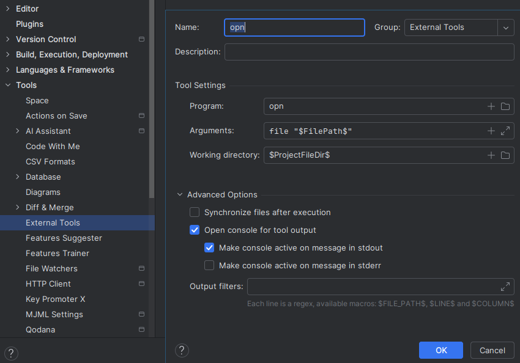

# Integrations
This document describes how `opn` can be integrated with other tools.

Table of contents:
- [JetBrains IDEs](#jetbrains-ides)
- [nnn](#nnn), the terminal file manager

## JetBrains IDEs
A JetBrains IDE shortcut can be configured to show `opn` for a selected or open file.

1. Open settings > Tools > External tools, click on the `+` icon, and
   enter the following data:
    - Name (Arbitrary)
    - Program: `opn`
    - Arguments: `file "$FilePath$"`
    - Working directory (optional): `$ProjectFileDir$`
    - Check _Open console for tool output_
    - _Make console active on message in stdout_  
      Unfortunately, the terminal is not focused, even when this option is active.
      As a workaround, use the _Run_ shortcut to focus the `opn` prompt.  
      See https://youtrack.jetbrains.com/issue/IJPL-12145/External-tools-Make-console-active-doesnt-focus-the-tool-window.

   

2. Open settings > Keymap > External Tools > External Tools > opn, and add a shortcut

   

## nnn
**nnn** is a terminal file manager. `opn` can be configured as its opener.

1. Copy [`nnn.sh`](./nnn.sh?raw=1) to your system. Suggested locations are:
   - In home, `~/.config/nnn/plugins/opn_nnn`.
   - Outside home, `/usr/lib/opn/nnn`.
1. Set the following environment variables:
   - Set the `NNN_OPENER` environment variable to the absolute path of the script you just copied.
   - Include `c` in `NNN_OPTS` or use the `-c` flag when running nnn.

   This is usually done in `.bashrc`/`.zshrc`/...
1. Done. Now, when you open a file in nnn (default Enter), `opn` will be used.
